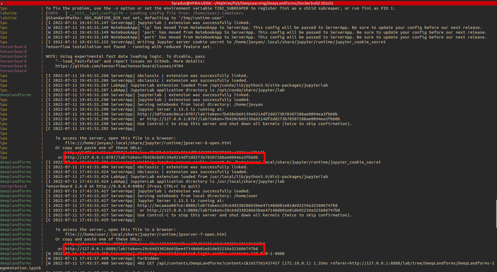
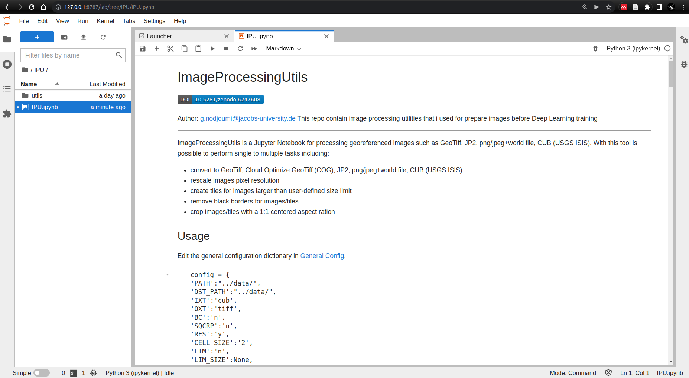
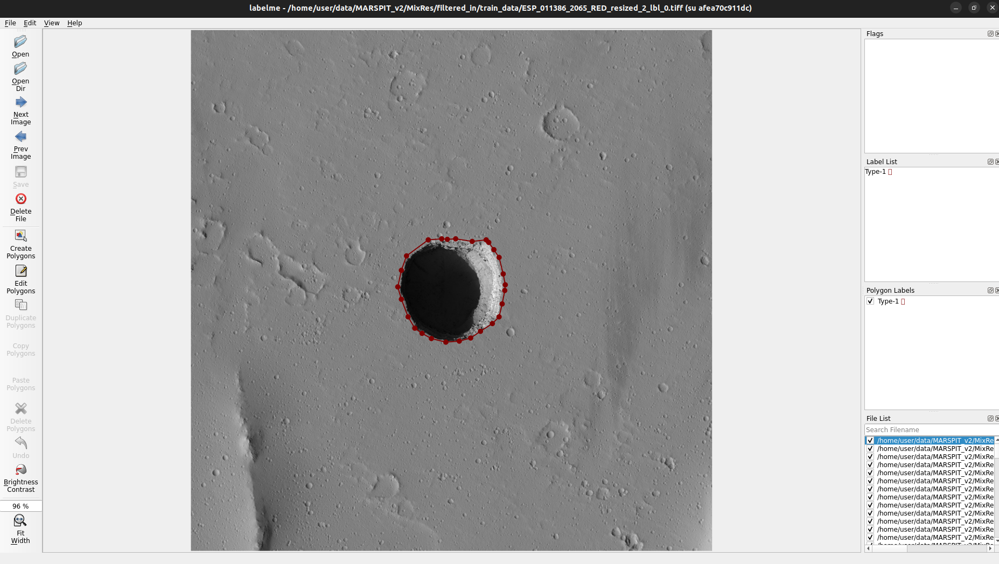
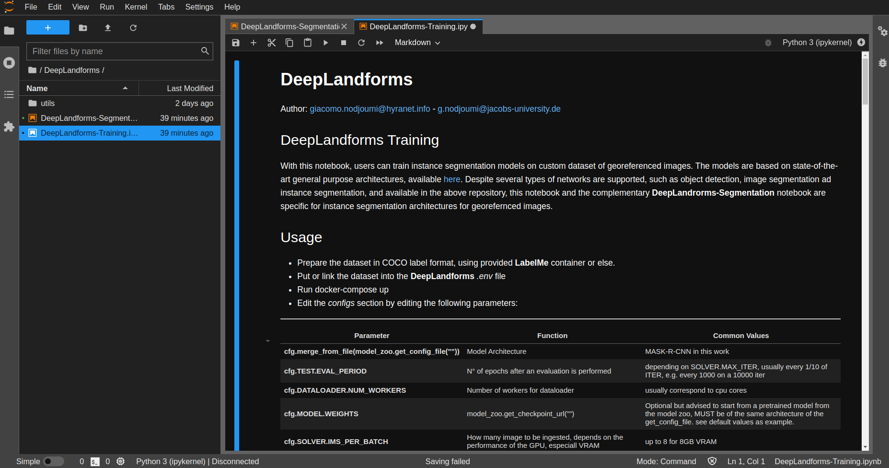
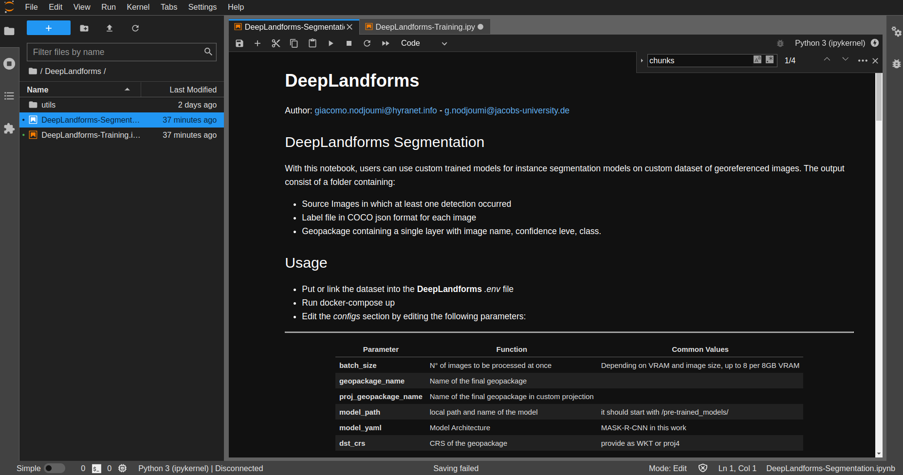
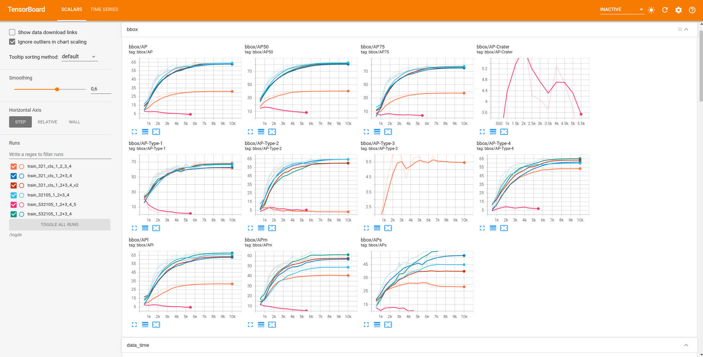

# **DeepLandforms tutorial**

Author: giacomo.nodjoumi@hyranet.info - g.nodjoumi@jacobs-university.de


- [**DeepLandforms tutorial**](#--deeplandforms-tutorial--)
  * [Workflow](#workflow)
  * [Requirements](#requirements)
  * [Installation](#installation)
    + [ENV FILE](#env-file)
    + [docker-compose](#docker-compose)
    + [ImageProcessingUtils (IPU)](#imageprocessingutils--ipu-)
    + [LabelMe](#labelme)
    + [DeepLandforms-Training](#deeplandforms-training)
    + [DeepLandforms-Inference](#deeplandforms-inference)
    + [Tensorboard](#tensorboard)
  * [Additional Scripts for Data Augmentation](#additional-scripts-for-data-augmentation)
    + [LBL2GPKG](#lbl2gpkg)
    + [lbl-replicator](#lbl-replicator)
    + [JSONFILTER](#jsonfilter)

________________________________________________________________________________________________
## Workflow


## Requirements

* 25 GB of free disk space
* Ubuntu OS or other distro
* Docker -> [Installation](https://docs.docker.com/engine/install/ubuntu/)
* Nvidia-docker -> [Installation](https://docs.nvidia.com/datacenter/cloud-native/container-toolkit/install-guide.html)
* Nvidia GPU
* 16GB RAM (more is better, especially when processing very high-resolution images)
* 8+ cpu cores

## Installation

### ENV FILE
**Location:** *Dockerbuild* folder

Once the requirements are fulfilled, the first step is to edit the .env file that contains all the configuration parameters to build and execute correctly *DeepLandforms*.

This file is a hidden file (docker constrain) in the *Dockerbuild* folder and contain the following text.

```
DATA_DIR= EXAMPLE_PATH_TO_DATA_DIRECTORY # path on the host where data is stored

**Edit below only if necessary of in case of port conflicts with other services**

DL_JUPYTER_PORT=8888
DL_JUPYTER_TOKEN=123456
DL_JUPYTER_DIR=/home/user/DeepLandforms               # DO NOT EDIT
DL_DIR = ./DL
IPU_JUPYTER_PORT=8787
IPU_JUPYTER_TOKEN=123456
IPU_JUPYTER_DIR=/home/user/DeepLandforms               # DO NOT EDIT
IPU_DIR = ./IPU
TENSORBOARD_PORT=8989
TENSORBOARD_DIR=/logdir                # DO NOT EDIT
UID=1000 # edit to match yout current user. use command id -u
GID=1000 # edit to match yout current group. use command id -g
UNAME=user # optional
PASSWORD=123456 # optional
```

### docker-compose

Open a terminal and move to the *Dockerbuild* folder, then run:

```
docker-compose up --build
```
This command will build and run all components (docker containers)
At the end of the build:
* LabelME window will pop-up
* In the terminal will be displayed the local urls (including access tokens) *ImageProcessingUtils* and *DeepLandforms* component.
See the red boxes in below image.



By left-clicking on both the urls, the browser will open displaying the notebooks.

For Tensorboard the url will always be localhost:port where the port is defined in the .env file (TENSORBOARD_PORT=8989)


### ImageProcessingUtils (IPU)

IPU configurations is pretty straightforward

```
config = {
'PATH':"../data/MARSPIT_v2/test_pit",  path inside the notebook where data is
'DST_PATH':"../data/MARSPIT_v2/test_pit", path inside the notebook where data will be saved
'IXT':'jp2', Input file eXTension
'OXT':'tiff', Output file eXTension
'BC':'n', Border Crop -> yes if you want to attempt to remove black borders from the image
'SQCRP':'n', SQuare CRoP -> yes you you want to crop the image with a 1:1 aspect ratio from the center
'RES':'n', RESize -> yes if you want to change the cell size
'CELL_SIZE':None, Integer value, only necessary if RES is yes
'LIM':'y', LIMit widht/height under a certain value. -> Yes will create TILES with max width or max height based on LIM_SIZE.
'LIM_SIZE':8000,
'COG':'n', yes if you want the output in CloudOptimized GeoTiff
'8bit':'y', yes if you want to convert to 8bit
'dem':'n', yes if the input is a DEM (this will limit some internal functions)
'overlap':5 Integer value of the corresponding percentage of overlap between tiles, only works when LIM is yes
}
```
Then just execute all the cells.



### LabelMe



See official tutorial [here](https://github.com/wkentaro/labelme/tree/main/examples/instance_segmentation)

### DeepLandforms-Training



***Usage***

Edit the following parameters (if necessary)

In cell N*4

basepath = 'MARSPIT_v2/MixRes/filtered_in/'
home_dir = '/home/user/data/'

Then in cell 14 **CONFIGS - edit befor run**
------------------------------------------------------------------
| **Parameter** | **Function** | **Common Values** |
| ---- | ---- | ---- |
| **cfg.merge_from_file(model_zoo.get_config_file(""))** | Model Architecture | MASK-R-CNN in this work |
| **cfg.TEST.EVAL_PERIOD** |  N° of epochs after an evaluation is performed | depending on SOLVER.MAX_ITER, usually every 1/10 of ITER, e.g. every 1000 on a 10000 iter |
| **cfg.DATALOADER.NUM_WORKERS** | Number of workers for dataloader | usually correspond to cpu cores |
| **cfg.MODEL.WEIGHTS** | model_zoo.get_checkpoint_url("") | Optional but advised to start from a pretrained model from the model zoo, MUST be of the same architecture of the get_config_file. see default values as example. |
| **cfg.SOLVER.IMS_PER_BATCH** | How many image to be ingested, depends on the performance of the GPU, especiall VRAM |  up to 8 for 8GB VRAM |
| **cfg.SOLVER.BASE_LR** | learning rate | 0.0002 is a good starting point |
| **cfg.SOLVER.MAX_ITER** | N° of epochs | Rise up for low mAP, lower to prevent overfitting |
| **cfg.MODEL.ROI_HEADS.BATCH_SIZE_PER_IMAGE** | parameter to sample a subset of proposals coming out of RPN to calculate cls and reg loss during training. | multiple of 2, commonly 64 |
------------------------------------------------------------------

***Then just execute all the cells.***

### DeepLandforms-Inference



***Usage***

* Put or link the dataset into the **DeepLandforms** *.env* file
* Run docker-compose up
* Edit the *configs* section by editing the following parameters:
------------------------------------------------------------------
| **Parameter** | **Function** | **Common Values** |
| ---- | ---- | ---- |
| **batch_size** | N° of images to be processed at once | Depending on VRAM and image size, up to 8 per 8GB VRAM |
| **geopackage_name** |  Name of the final geopackage |  |
| **proj_geopackage_name** | Name of the final geopackage in custom projection | |
| **model_path** | local path and name of the model  | it should start with /pre-trained_models/ |
| **model_yaml** | Model Architecture | MASK-R-CNN in this work | EDIT according to trained model selected |
| **dst_crs** | CRS of the geopackage | provide as WKT or proj4

and eventuall in cell 6

cfg = get_cfg()
cfg.merge_from_file(model_zoo.get_config_file(model_yaml))
cfg.MODEL.ROI_HEADS.NUM_CLASSES =  len(classes)
cfg.MODEL.WEIGHTS = model_path
cfg.MODEL.ROI_HEADS.SCORE_THRESH_TEST = 0.2
cfg.SOLVER.IMS_PER_BATCH = batch_size
cfg.MODEL.ROI_HEADS.BATCH_SIZE_PER_IMAGE =  1024
cfg.SOLVER.AMP.ENABLED=True

------------------------------------------------------------------

***Then just execute all the cells.***
### Tensorboard

Go to ***localhost:TENSORBOARD_PORT***


## Additional Scripts for Data Augmentation

### LBL2GPKG

This scripts read the json file and image from a folder and extract each label from the image and save as separate file+json.
It simply crop out all label contained in an image and saves into separate images + json label.
Then save image name, class and shape (geometry) into a geodataframe.

To run it, open through jupyter lab and edit:

src_dir = local path to data (e.g., ../data/data)
ssize = 0.5


This script works only with the folder and file naming convention of IPU, later versions will be generalized.
### lbl-replicator

This script read the geopackage created by LBL2GPGK and using both file name and geometry field, extract the same labels from different versions of the same image. e.g., same image at different cell resolution

This script works only with the folder and file naming convention of IPU, later versions will be generalized.


To run it, open through jupyter lab and edit:

src_dir = local path to src data (e.g., ../data/data)
ssize = 0.5

dst_dir = local path to dst data (images variant)
dsize = 1

### JSONFILTER

This script read a folder containing image + labels and upon editing a list of valid and non-valid labels it filters in and out in two separated folders

This script works only with the folder and file naming convention of IPU, later versions will be generalized.


To run it, open through jupyter lab and edit:

src_dir = local path to src data (e.g., ../data/data)
valid_classes = [list of valid classes]
